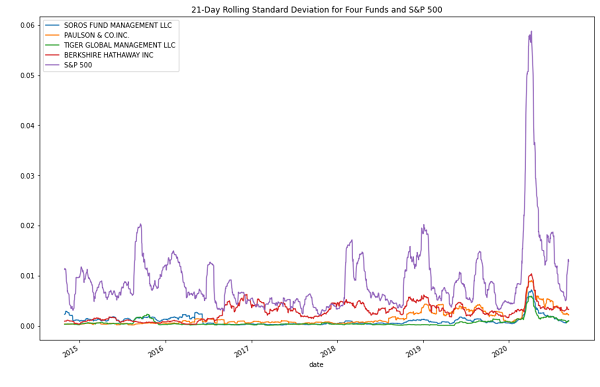
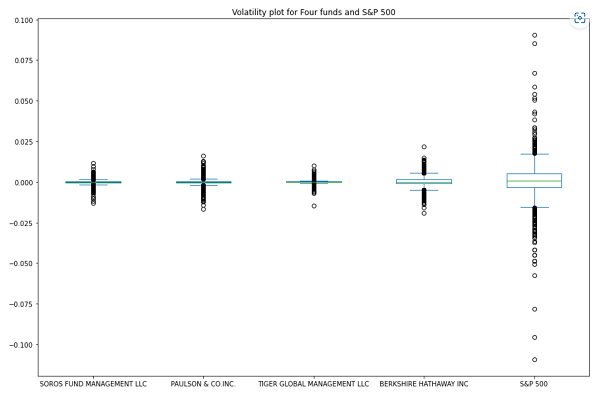
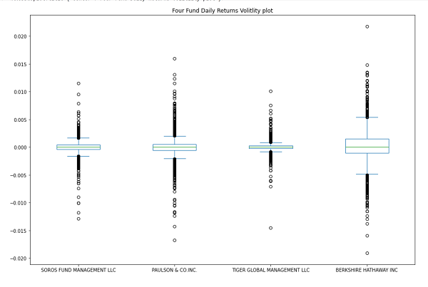
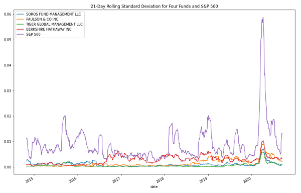
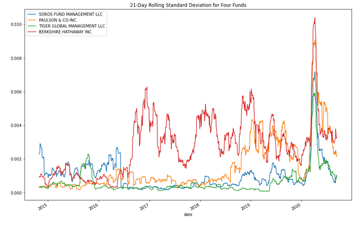
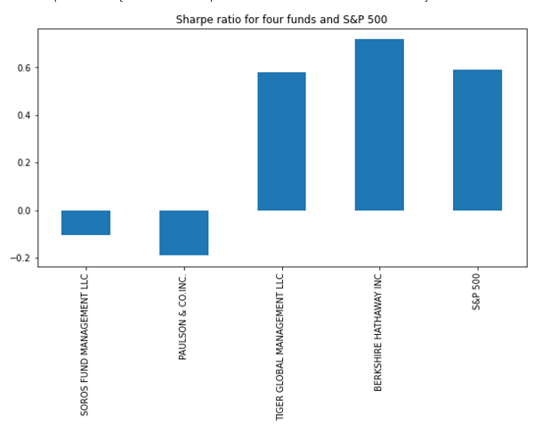
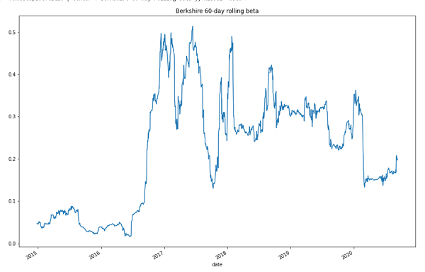
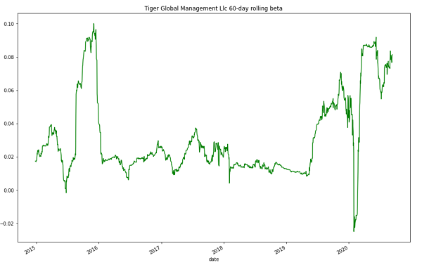

# Investment_Solution

The purpose of this repository is to evaluate four new investment options for inclusion in the client portfolios. To achieve that we need to determine the fund with the most investment potential based on key risk-management metrics: the daily returns, standard deviations, Sharpe ratios, and betas.

## Technologies

This project leverages python 3.9 with the following packages:
*[Jupyter notebook file]
*[pandas]
*[matplotlib]

## Installation Guide

Before running the application first install the following dependencies.

```python
pip install Jupyter lab
pip install pandas
pip install matplotlib
```

## Usage

Performing quantitative analysis on four funds and to provide two best option to include in the portfolios.

## Components of quantitative analysis

## Data preparation

1. Created dataframe for whale_navs.csv

2. calculated daily returns

```python
whale_daily_returns= whale_navs_df.pct_change().dropna()
```

## Analyze the Performance

 To determine if any of the portfolios outperform the broader stock market, which the S&P 500 represents. To do so, following steps were taken:

1. Plot function to visualize the daily return data of the four fund portfolios and the S&P 500.

2. calculate the cumulative returns for the four fund portfolios and the S&P 500.

3. visualize the cumulative return values for the four funds and the S&P 500 over time.



## Analyze the Volatility

Analyze the volatility of each of the four fund portfolios and of the S&P 500. To do so, complete the following steps:

1. Box plot to visualize the daily return data for each of the four portfolios and for the S&P 500.



2. Analysing the data for just the four fund portfolios by dropping the S&P 500 column. Visualize the daily return data for just the four fund portfolios by using another box plot.



## Analyze the Risk

Evaluate the risk profile of each portfolio by using the standard deviation and the beta. To do so, complete the following steps:

1. calculate the standard deviation for each of the four portfolios and for the S&P 500.

2. Calculate the annualized standard deviation for each of the four portfolios and for the S&P 500.

3. Ploting the rolling standard deviations of the four fund portfolios and of the S&P 500 index.



4. Plot the rolling standard deviations of only the four fund portfolios.



## Analyze the Risk-Return Profile

calculating risk return on all four funds.
 For this reason, Sharpe ratios for each portfolio has been considered. To do so, following steps were taken:

1. Calculate the annualized average return data for the four fund portfolios and for the S&P 500.

2. Calculate the Sharpe ratios for the four fund portfolios and for the S&P 500.

3. Visualize the Sharpe ratios for the four funds and for the S&P 500 in a bar chart.



Answer the following question: Which of the four portfolios offers the best risk-return profile? Which offers the worst?

## Diversify the Portfolio

 To evaluate how the portfolios react relative to the broader market. Based on the analysis so far, two portfolios were choosen to  recommnd as investment options.

1. Calculated the variance of the S&P 500 by using a 60-day rolling window.

2. Using the 60-day rolling window, the daily return data, and the S&P 500 returns, calculate the covariance for both Berkshire Hathaway Inc and Tiger Global Management LLC.

3. Calculate the beta for both funds.

```python
berkshire_60_day_rolling_beta = whale_60_day_rolling_covariance / snp_60_day_rolling_variance
tiger_60_day_rolling_beta = tiger_60_day_rolling_covariance / snp_60_day_rolling_variance
```

4. Calculate the average value of the 60-day rolling beta of the portfolio.

```
print(f"Average 60-day rolling beta for berkshire Hathaway Inc is {berkshire_60_day_rolling_beta.mean():.02f}.")

Average 60 day rolling beta = 0.22

print(f"Average 60-day rolling beta for Tiger Global Management is {tiger_60_day_rolling_beta.mean():.02f}.")

Average 60 day rolling beta = 0.03
```

Plot the 60-day rolling beta.





## Conclusion

Berkshire Hathaway Inc outperformed most funds, but still lagged behind the S&P 500. Despite being high in volatility and risk, it offered a better return on risk than the market. Its average rolling beta was low, at 0.21, indicating a low correlation with the S&P 500, making it a good choice for diversification.

In contrast, Tiger Global Management underperformed compared to other funds, but had the lowest volatility and risk, while still providing the best return on risk. With an average rolling beta close to zero, at 0.03, it is not strongly correlated with the market.
